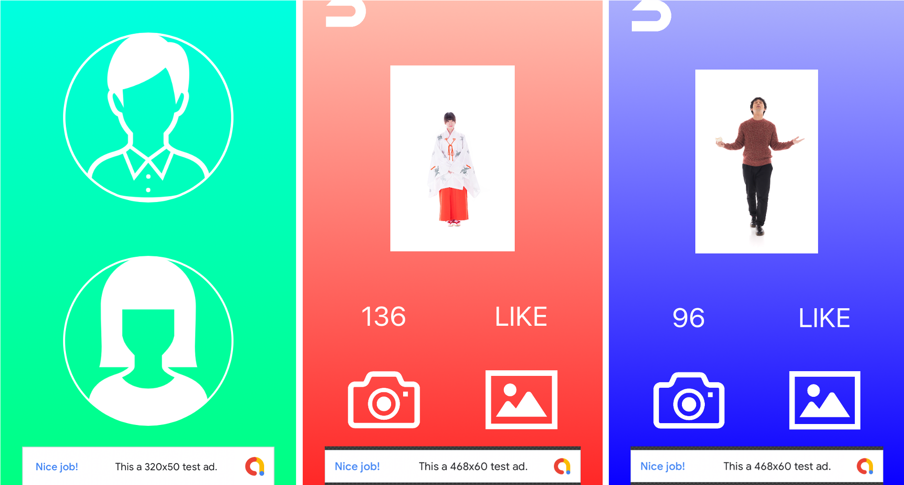

# CHECK

## About
コーディネートがファッションコーディネートサイト[WEAR](https://wear.jp/)に投稿した際に何いいね付くかを予測してくれるアプリです。また採点結果はSNSでシェアすることができます。

## 使用技術

* Keras（モデル作成）

* Swift（アプリ開発）

## URL
* [AppStore](https://itunes.apple.com/jp/app/check-%E6%9C%8D%E8%A3%85%E6%8E%A1%E7%82%B9%E3%82%A2%E3%83%97%E3%83%AA/id1448979928?l=ja&ls=1&mt=8)(Developer Programが期限切れなため
インストールできません)
* [Qiita](https://qiita.com/NakaokaRei/items/03dd5587babcc5f772d3)
